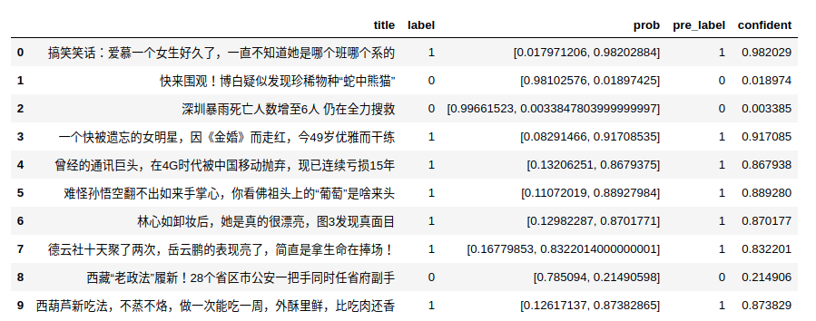
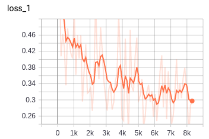
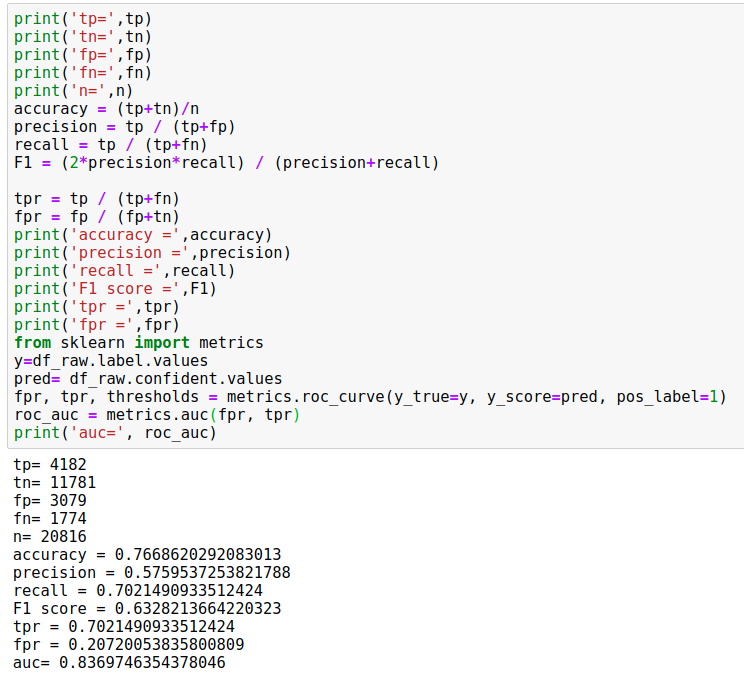
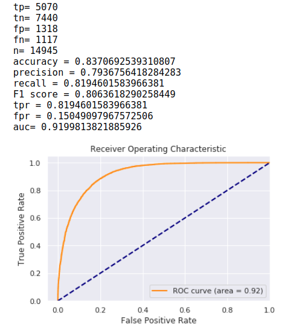
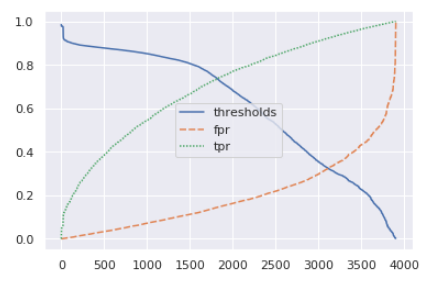
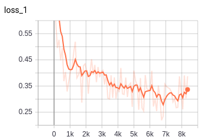
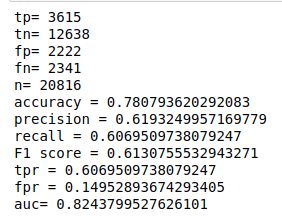
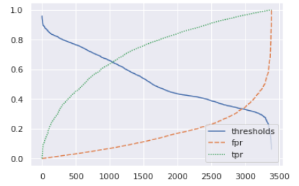

# bert_multi_gpu

### Transformer考上了北京大学；CNN进了中等技术学校；RNN在百货公司当售货员：我们都有光明的前途。

## 基本介绍

Base bert模型采用的是[中文预训练BERT-wwm-ext](https://github.com/ymcui/Chinese-BERT-wwm)。与bert或者bert-wwm的主要区别在于使用了extended data，并在数据集上迭代了更多步（100k -> 1M）。

我的下游任务为文本点击率分级。输入为文章标题，希望能找到其与点击率CTR的关系。个人认为需要模型能够理解语义，判断出究竟哪些标题更吸引人，而不是像word2vec，lda等其他算法学到统计学的特征。


### 模型基线：简体中文阅读理解：CMRC 2018
[**CMRC 2018数据集**](https://github.com/ymcui/cmrc2018)是哈工大讯飞联合实验室发布的中文机器阅读理解数据。
根据给定问题，系统需要从篇章中抽取出片段作为答案，形式与SQuAD相同。

| 模型 | 开发集 | 测试集 | 挑战集 |
| :------- | :---------: | :---------: | :---------: |
| BERT | 65.5 (64.4) / 84.5 (84.0) | 70.0 (68.7) / 87.0 (86.3) | 18.6 (17.0) / 43.3 (41.3) | 
| ERNIE | 65.4 (64.3) / 84.7 (84.2) | 69.4 (68.2) / 86.6 (86.1) | 19.6 (17.0) / 44.3 (42.8) | 
| **BERT-wwm** | 66.3 (65.0) / 85.6 (84.7) | 70.5 (69.1) / 87.4 (86.7) | 21.0 (19.3) / 47.0 (43.9) | 
| **BERT-wwm-ext** | 67.1 (65.6) / 85.7 (85.0) | 71.4 (70.0) / 87.7 (87.0) | 24.0 (20.0) / 47.3 (44.6) |
| **RoBERTa-wwm-ext** | **67.4 (66.5) / 87.2 (86.5)** | **72.6 (71.4) / 89.4 (88.8)** | **26.2 (24.6) / 51.0 (49.1)** |

## 用两块1080ti做的bert fine tune

gpu性能基本都是跑满的。一块1080ti大概每秒可以训练60个case。两块可以提升到每秒110个case左右。(batch size = 32)


## bert样本数据


## 示例结果：


# 模型结构 & 结果评估
---
Model Architecture     |AUC| Accuracy | Eval Loss | Precision |
--------------|-------: |---------------:|-----------:|-----------:
Bert + LR       | 0.8369  | 0.7668         |  0.4514   | 0.5760
Bert + CNN       | 0.8243  |  0.7807    |  0.4489 | 0.6070

## 主要代码修改
具体细节参考 
- bert_my/run_classifier_lr.py
- bert_my/run_classifier_cnn.py
- bert_my/run_classifier_rcnn.py

实现InfoProcessor类与部分模型改动。

### 模型1： BERT+LR
```angular2
python ./bert_my/run_classifier_lr.py \
  --task_name=info \
  --do_lower_case=true  \
  --do_train=false  \
  --do_eval=false  \
  --do_predict=true  \
  --save_for_serving=true  \
  --data_dir=./  \
  --vocab_file=./bert_model_wwm/vocab.txt  \
  --bert_config_file=./bert_model_wwm/bert_config.json  \
  --init_checkpoint=./bert_model_wwm/bert_model.ckpt \
  --max_seq_length=64 \
  --train_batch_size=32 \
  --learning_rate=2e-5 \
  --num_train_epochs=1.0 \
  --use_gpu=true \
  --num_gpu_cores=2 \
  --use_fp16=true \
  --output_dir=./output_lr
```

#### 训练loss


#### eval的结果

模型指标



ROC曲线



TPR-FPR-Threshold 曲线



### 模型2： BERT+CNN
```angular2
python ./bert_my/run_classifier_cnn.py \
  --task_name=info \
  --do_lower_case=true  \
  --do_train=false  \
  --do_eval=true  \
  --do_predict=true  \
  --save_for_serving=true  \
  --data_dir=./  \
  --vocab_file=./bert_model_wwm/vocab.txt  \
  --bert_config_file=./bert_model_wwm/bert_config.json  \
  --init_checkpoint=./bert_model_wwm/bert_model.ckpt \
  --max_seq_length=64 \
  --train_batch_size=32 \
  --learning_rate=2e-5 \
  --num_train_epochs=5.0 \
  --use_gpu=true \
  --num_gpu_cores=2 \
  --use_fp16=true \
  --output_dir=./output
```

#### 训练loss


#### eval的结果

模型指标



ROC曲线


TPR-FPR-Threshold 曲线




### 附：模型一些基本操作的顺序
可以参考[这里](https://www.quora.com/In-most-papers-I-read-the-CNN-order-is-convolution-relu-max-pooling-So-can-I-change-the-order-to-become-convolution-max-pooling-relu)和[这里](https://miracleyoo.tech/2018/08/21/layer-order/)

    # Ideal order : conv -> bn -> activation -> max pooling -> dropout -> dense(softmax)
    # Same as : conv -> bn -> max pooling -> activation -> dropout -> dense(softmax) [faster]
    # Since ReLU is monotonic (if a > b, ReLU(a) >= ReLU(b)).

## Sevrving as service


